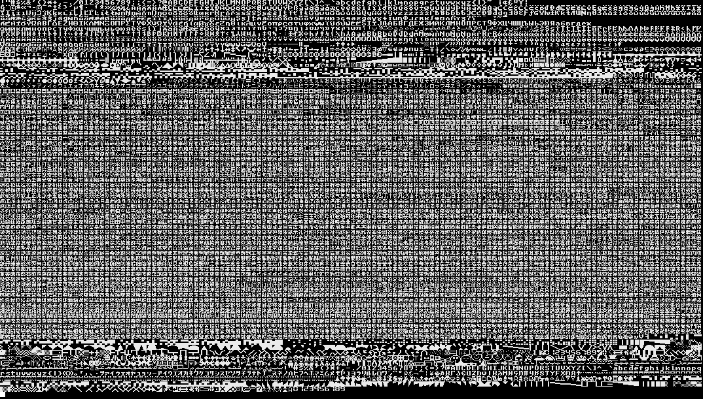

### carado's fork of [unscii](http://pelulamu.net/unscii/)

All additions to unscii (either by myself or taken from [funscii](https://github.com/asiekierka/funscii)) are in `extra-*`; a comment at the top of which specifies the source.

* `extra-alchemy.txt`: 🜁 🜂 …
* `extra-arrows.txt`: ⭳ ↤ …
* `extra-gothic.txt`: 𐌰 𐌱 𐌸 𐌳 …
* `extra-ipa.txt`: ʀ ɐ ɑ ʌ ɪ …
* `extra-latin.txt`: Ꝟ …
* `extra-math{,-2}.txt`: ⨁ ∫ ∈ ⊢ …
* `extra-misc.txt`: �
* `extra-pictures.txt`: ⛩ ☯ 🍙 🍁 …
* `extra-punctuation.txt`: ⟨ „ ⸘ …
* `extra-runes.txt`: ᛦ …
* `extra-shapes.txt`: ‣ …
* `extra-textsymbols.txt`: ₪ ₣ …

`extra-misaki.txt` is special file containing asian characters from the misaki font (included) minus characters already covered by other files; run `make-extra-misaki.sh` to regenerate.

The effort was focused on the 8×8 variant of unscii; not many `extra-*` characters have 8×16 variants implemented.
As well as a few fixes to mistakes in unscii.

Running `upd.sh` will generate `unscii-8.hex` and `unscii-8.bdf`; then running `./chars` or `./compact.sh` will print the current set of supported characters; the output of the which has been reproduced below: 

